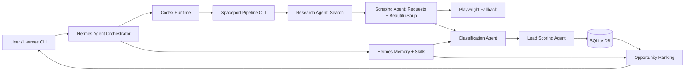

# Spaceport Lead Research Architecture

## Goal

Find the highest-value United States land development civil engineering firms for Spaceport, with emphasis on firms likely to automate grading, utility drafting, plan production, and Civil 3D-heavy workflows.

## Folder Structure

```text
lead_gen/
  config/spaceport.yaml            # ICP, search, scraping, and scoring config
  data/                            # Local SQLite database lives here
  docs/ARCHITECTURE.md             # System design
  docs/ROADMAP.md                  # Build plan
  scripts/setup-dev.ps1            # Local Python environment setup
  scripts/setup-hermes.ps1         # Hermes install helper
  sql/schema.sql                   # SQLite schema, PostgreSQL-friendly shape
  src/spaceport_leads/             # New Phase 1 implementation
  lead_automation.py               # Existing Google Sheets workflow, preserved
```

## Architecture Diagram



## Agent Responsibilities

Research Agent finds candidate firms by geography and land-development query patterns.

Scraping Agent fetches homepage, services, projects, portfolio, about, and careers pages. It uses HTTP and BeautifulSoup first; Playwright is reserved for JavaScript-heavy sites.

Classification Agent checks ICP fit and rejects obvious non-fits such as survey-only, geotech-only, environmental-only, MEP-only, or architecture-only firms.

Lead Scoring Agent produces a 0-100 score using five components: land development focus, Civil 3D likelihood, drafting intensity, AI fit, and firm size.

Contact Discovery Agent is planned for Phase 2. It will search site team pages, careers pages, LinkedIn-style snippets, and contact pages for target roles.

Opportunity Ranking Agent orders firms by latest score and keeps evidence URLs attached.

## Database Schema

Core tables:

- `firms`: company identity, website, market, description
- `firm_sources`: search results and scraped page text
- `firm_scores`: rubric component scores and reasoning
- `contacts`: people and target titles
- `research_runs`: audit history per geography
- `research_run_firms`: run-to-firm ranking records

The schema uses simple integer primary keys and text timestamps so SQLite works now. Migration to PostgreSQL later is straightforward: replace `INTEGER PRIMARY KEY` with identity columns, keep foreign keys, and move from local `sqlite3` calls to SQLAlchemy or Supabase client calls.

## Installation Commands

```powershell
cd C:\Users\judds\OneDrive\Desktop\safe-social\All-Properties-SPCPRT\lead_gen
.\scripts\setup-dev.ps1
```

Hermes install:

```powershell
.\scripts\setup-hermes.ps1
```

Hermes/Codex connection after install:

```text
hermes setup
hermes auth login codex
hermes
/codex-runtime codex_app_server
```

Hermes’ Codex runtime is opt-in. The official docs say enabling `/codex-runtime codex_app_server` lets Hermes use Codex CLI’s runtime, sandbox, file edits, shell, MCP tools, and installed Codex plugins while Hermes keeps sessions, memory, skill review, and orchestration.
